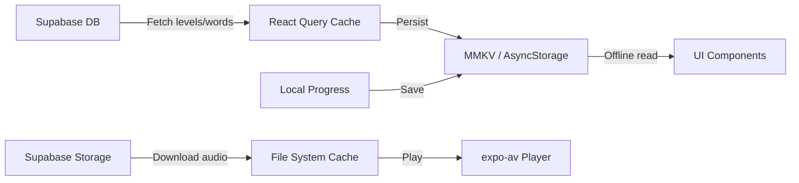
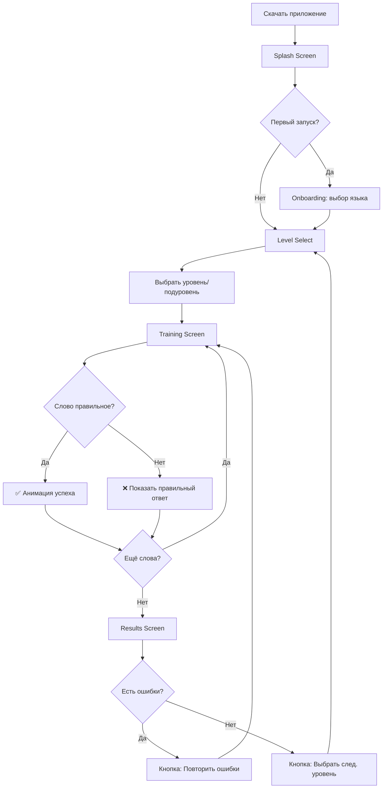

# 📱 PRD: Space Spelling Bee — Мобильное приложение (MVP)

> **Дата**: 10 марта 2026  
> **Версия**: 1.0 MVP  
> **Проект**: Space Spelling Bee Mobile  
> **Статус**: Черновик  

---

## 1. Обзор продукта

### 1.1 Описание
Мобильное приложение для тренировки правописания английских слов с космической тематикой. Дети скачивают приложение, выбирают уровень сложности и тренируются в написании слов — **без регистрации и авторизации**.

### 1.2 Целевая аудитория
- **Основная**: дети 6–14 лет, изучающие английский язык
- **Вторичная**: родители, которые скачивают приложение для детей

### 1.3 Ключевое ценностное предложение
> Скачал → выбрал уровень → начал тренироваться. Без регистрации, без барьеров.

### 1.4 Платформы
- **iOS** (App Store)
- **Android** (Google Play)
- Единая кодовая база: **React Native** (Expo)

---

## 2. Связь с существующей платформой

Текущая веб-версия (PWA) построена на:
- React 18 + TypeScript + Vite
- Supabase (backend, БД, аудио-файлы)
- TTS провайдеры (OpenAI, ElevenLabs, Kokoro)
- Космическая тема оформления

Мобильное приложение будет использовать:
- **Ту же базу данных Supabase** (таблицы: `languages`, `levels`, `sublevels`, `words`, аудио-файлы)
- **Те же аудио-файлы** из Supabase Storage
- **Ту же структуру уровней и слов**

---

## 3. Функциональные требования (MVP)

### 3.1 Онбординг (без регистрации)

| # | Требование | Приоритет |
|---|-----------|-----------|
| F-01 | При первом запуске показать приветственный экран с космической тематикой | Must |
| F-02 | Предложить выбрать язык (казахский/русский) для интерфейса | Must |
| F-03 | Переход к выбору уровня без создания аккаунта | Must |
| F-04 | Сохранять прогресс локально на устройстве (AsyncStorage) | Must |

### 3.2 Выбор уровня

| # | Требование | Приоритет |
|---|-----------|-----------|
| F-05 | Отобразить список всех доступных уровней с визуальной космической картой | Must |
| F-06 | Каждый уровень — «планета» или «галактика» в космическом пространстве | Must |
| F-07 | Показать количество слов и подуровней в каждом уровне | Must |
| F-08 | Показать прогресс пользователя по каждому уровню (из локального хранилища) | Must |
| F-09 | Уровни загружаются из Supabase при наличии интернета и кешируются | Must |

### 3.3 Тренировка (основной функционал)

| # | Требование | Приоритет |
|---|-----------|-----------|
| F-10 | Воспроизвести аудио произношения слова (из Supabase Storage) | Must |
| F-11 | Поле ввода для набора слова по буквам | Must |
| F-12 | Кнопка «Повторить» — воспроизвести аудио ещё раз | Must |
| F-13 | Проверка правильности ввода (сравнение с эталоном) | Must |
| F-14 | Визуальная обратная связь: ✅ правильно / ❌ неправильно | Must |
| F-15 | При неправильном ответе: показать правильное написание | Must |
| F-16 | Переход к следующему слову | Must |
| F-17 | Прогресс-бар текущего подуровня (сколько слов пройдено) | Must |
| F-18 | Экран результатов после завершения подуровня | Must |

### 3.4 Режим практики (повтор ошибок)

| # | Требование | Приоритет |
|---|-----------|-----------|
| F-19 | Отдельный режим для повторения слов, в которых были ошибки | Should |
| F-20 | Сохранять слова с ошибками локально | Should |

### 3.5 Прогресс и статистика

| # | Требование | Приоритет |
|---|-----------|-----------|
| F-21 | Экран статистики: общее количество пройденных слов | Should |
| F-22 | Процент правильных ответов по каждому уровню | Should |
| F-23 | Streak-счётчик (дни подряд занятий) | Could |
| F-24 | Лёгкая анимация/поздравление при достижении milestone | Should |

### 3.6 Офлайн-режим

| # | Требование | Приоритет |
|---|-----------|-----------|
| F-25 | Кешировать данные уровней и слов при первой загрузке | Must |
| F-26 | Скачивать аудио-файлы при переходе на уровень | Must |
| F-27 | Возможность тренироваться без подключения к интернету | Must |
| F-28 | Синхронизация кеша при следующем подключении | Should |

---

## 4. Нефункциональные требования

### 4.1 Производительность

| # | Требование |
|---|-----------|
| NF-01 | Запуск приложения — не более 3 секунд |
| NF-02 | Воспроизведение аудио — не более 500 мс задержка |
| NF-03 | Размер приложения — не более 50 МБ (без кешированного контента) |

### 4.2 UX/UI

| # | Требование |
|---|-----------|
| NF-04 | Космическая тема: тёмный фон, звёзды, планеты, анимации |
| NF-05 | Крупные кнопки и текст для детей (минимум 16sp для основного текста) |
| NF-06 | Автоматическая клавиатура при вводе слова |
| NF-07 | Поддержка портретной ориентации (основная) |
| NF-08 | Анимации переходов между экранами |
| NF-09 | Звуковые эффекты: правильный/неправильный ответ, завершение уровня |

### 4.3 Безопасность и соответствие

| # | Требование |
|---|-----------|
| NF-10 | Соответствие COPPA (Children's Online Privacy Protection Act) — без сбора персональных данных |
| NF-11 | Без рекламы в MVP |
| NF-12 | Без встроенных покупок в MVP |
| NF-13 | Без внешних ссылок и перенаправлений |

---

## 5. Технический стек

| Компонент | Технология |
|-----------|-----------|
| Фреймворк | React Native (Expo SDK 52+) |
| Язык | TypeScript |
| Навигация | React Navigation 7 |
| Локальное хранилище | AsyncStorage + MMKV |
| HTTP/API | Supabase JS SDK |
| Аудио | expo-av |
| Анимации | react-native-reanimated |
| Иконки | expo-vector-icons, Lottie (космические анимации) |
| Стили | NativeWind (Tailwind CSS для React Native) |

### 5.1 Архитектура

```
src/
├── app/                    # Навигация, провайдеры
│   ├── navigation/         # Stack Navigator, Tab Navigator
│   └── providers/          # QueryClient, Theme, etc.
├── screens/                # Экраны приложения
│   ├── OnboardingScreen/   # Приветствие + выбор языка
│   ├── LevelSelectScreen/  # Космическая карта уровней
│   ├── SublevelScreen/     # Список подуровней
│   ├── TrainingScreen/     # Основной экран тренировки
│   ├── ResultsScreen/      # Результаты подуровня
│   ├── PracticeScreen/     # Повтор ошибок
│   └── StatsScreen/        # Статистика и прогресс
├── shared/
│   ├── api/                # Supabase client, запросы
│   ├── lib/                # Утилиты, хелперы
│   ├── ui/                 # Переиспользуемые компоненты
│   └── storage/            # AsyncStorage, кеширование
├── entities/
│   ├── level/              # Модель уровня
│   ├── word/               # Модель слова
│   └── progress/           # Модель прогресса
└── features/
    ├── play-audio/          # Воспроизведение аудио
    ├── check-answer/        # Проверка ответа
    └── track-progress/      # Отслеживание прогресса
```

### 5.2 Работа с данными



- **Первый запуск**: скачать все уровни + слова → кешировать в MMKV
- **Переход на уровень**: скачать аудио-файлы подуровня → кешировать в файловой системе
- **Прогресс**: только локально (AsyncStorage), без отправки на сервер

---

## 6. Экраны приложения

### 6.1 Splash Screen
- Логотип с анимацией (пчела в космосе 🐝🚀)
- Длительность: 2 секунды

### 6.2 Onboarding Screen
- Приветственное сообщение
- Выбор языка интерфейса (🇷🇺 Русский / 🇰🇿 Қазақша)
- Кнопка «Начать» → переход на выбор уровня

### 6.3 Level Select Screen (Карта галактик)
- Вертикальный скролл с «космической картой»
- Каждый уровень — планета/звёздная система
- Индикатор прогресса (кольцо вокруг планеты)
- Нажатие → раскрытие подуровней

### 6.4 Training Screen (Основной экран)
- Кнопка воспроизведения аудио (большая, по центру)
- Автоматическое воспроизведение при переходе на слово
- Поле ввода (автофокус, клавиатура сразу открыта)
- Кнопка «Проверить»
- Прогресс-бар сверху
- Номер текущего слова / всего слов

### 6.5 Results Screen
- Количество правильных/неправильных ответов
- Звёзды (1–3) в зависимости от результата
- Список ошибок с правильными ответами
- Кнопка «Повторить ошибки» / «Далее»

### 6.6 Stats Screen
- Общий прогресс по всем уровням
- Количество изученных слов
- Процент правильных ответов
- Streak (дни подряд)

---

## 7. User Flow



---

## 8. Ограничения MVP

> [!IMPORTANT]
> Следующие функции **НЕ входят** в MVP v1.0:

| Функция | Статус | Планируемая версия |
|---------|--------|-------------------|
| Регистрация / авторизация | ❌ Не в MVP | v2.0 |
| Голосовой ввод (Speech-to-Text) | ❌ Не в MVP | v2.0 |
| Leaderboard / соревнования | ❌ Не в MVP | v2.0 |
| Push-уведомления | ❌ Не в MVP | v1.5 |
| Облачная синхронизация прогресса | ❌ Не в MVP | v2.0 |
| Монетизация (реклама / покупки) | ❌ Не в MVP | v2.0 |
| Родительский контроль | ❌ Не в MVP | v2.0 |
| Мультиязычный контент (кроме EN) | ❌ Не в MVP | v2.0 |
| Gamification (ачивки, монеты) | ❌ Не в MVP | v1.5 |

---

## 9. Метрики успеха MVP

| Метрика | Целевое значение |
|---------|-----------------|
| Установки за первый месяц | 500+ |
| DAU (ежедневные пользователи) | 50+ |
| Retention Day 7 | ≥ 30% |
| Среднее время сессии | ≥ 5 минут |
| Оценка в App Store | ≥ 4.0 |
| Crash-free rate | ≥ 99% |

---

## 10. Этапы разработки

### Фаза 1: Фундамент (1–2 неделя)
- [ ] Инициализация проекта (Expo + TypeScript)
- [ ] Настройка навигации (React Navigation)
- [ ] Подключение Supabase SDK
- [ ] Реализация кеширования (MMKV)
- [ ] Базовая дизайн-система (космическая тема)

### Фаза 2: Основной функционал (3–4 неделя)
- [ ] Splash Screen + Onboarding
- [ ] Level Select Screen (карта уровней)
- [ ] Загрузка и кеширование данных из Supabase
- [ ] Training Screen (аудио + ввод + проверка)
- [ ] Results Screen

### Фаза 3: Полировка (5 неделя)
- [ ] Анимации и звуковые эффекты
- [ ] Офлайн-режим
- [ ] Экран статистики
- [ ] Режим практики (повтор ошибок)
- [ ] Тестирование на устройствах

### Фаза 4: Публикация (6 неделя)
- [ ] Подготовка скриншотов для Store
- [ ] Описание приложения
- [ ] Настройка App Store / Google Play
- [ ] Подача на ревью
- [ ] Релиз 🚀

---

## 11. Риски и митигация

| Риск | Вероятность | Влияние | Митигация |
|------|-------------|---------|-----------|
| Отклонение App Store из-за COPPA | Средняя | Высокое | Обеспечить полное соответствие: без сбора данных, privacy policy |
| Большой размер кеша аудио | Высокая | Среднее | Скачивать аудио по уровням, не всё сразу; чистка кеша |
| Плохое качество аудио на слабых устройствах | Низкая | Среднее | Использовать лёгкие форматы (MP3/AAC), предзагрузка |
| Потеря локального прогресса при переустановке | Высокая | Высокое | Предупреждение пользователя; в v2.0 — облачная синхронизация |

---

## 12. Open Questions

1. **Какие именно уровни и слова будут доступны в MVP?** — Все текущие из базы или ограниченный набор?
2. **Нужен ли экран настроек** (громкость, скорость воспроизведения)?
3. **Нужна ли поддержка планшетов** (iPad, Android Tablet) в MVP?
4. **Branding**: использовать то же название «Space Spelling Bee» или другое для мобильной версии?
5. **Privacy Policy**: нужна ли отдельная страница/сайт с политикой конфиденциальности для публикации в Store?

---

> **Следующий шаг**: согласовать PRD → приступить к дизайну в Figma/Pencil → начать разработку.
